### README.md

National Geographic
=============

개발 환경
  

  
* C#
* MYSQL

등장 오브젝트

  

* 캐릭터(8방향)　　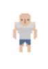

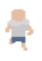

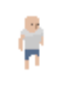
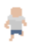

* 몬스터 및 오브젝트 　　　
                 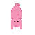 : 돼지　
                  : 유령　
                 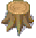 : 나무　
                 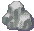 : 돌　

* 아이템 　　　　　　　
          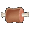 : 고기　
            : 장작　
           
           
* 조합 아이템 　　　
             : 횃불　
            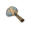 : 돌도끼　
             : 울타리　

  

게임 설명

  

### 몬스터와 어둠으로부터 살아남는 게임
+ 　　의 상태는 배고픔, 정신, 체력이 있습니다.
+ 　　배고픔은 시간이 지날 수록 떨어집니다.
+ 　　배고픔이 일정값 이하로 내려갔을 경우 체력이 떨어집니다.            
+ 　　배고픔이 0이 되면 캐릭터는 사망합니다.
+ 　　 를 잡아  를 얻어 체력과 배고픔을 +10 채울 수 있습니다.
+ 　　밤이 되면 정신 수치가 떨어집니다.
+ 　　 을 잡아 정신 수치를 회복할 수 있습니다.
+ 　　를 지어 집을 만들면 몬스터들로 부터 자신을 보호할 수 있습니다.
+ 　　나무는 　->　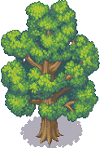　->　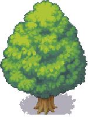　순으로 자랍니다.
+ 　　　를 스페이스바로 공격 시  ,  ,   의 재료인  을 획득할 수 있습니다.
+ 　　 는 일정시간 마다 필드내 랜덤한 위치에 생성됩니다.
+ 　　모든 아이템은 키보드 Z키를 이용해 획득할 수 있습니다.

